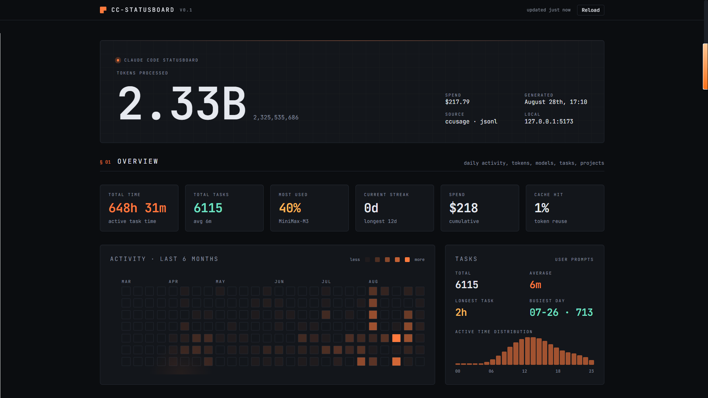

# Claude Code Statusboard

A local Web Statusboard for **Claude Code** usage — token / cost / model / task / project
analytics, with a mission-control-style UI built on top of your real session logs.



> Built on Claude Code's JSONL session logs.  [`ccusage`](https://ccusage.com/) is
> used as an offline pricing source and cross-check, never on the rebuild path.
> Owns its own intermediate data layer (`statusboard.json`) so the data sources stay
> swappable (Claude Code, Codex, OpenCode, custom agents).

## What you get

| Section                 | Source  | What it shows                                                          |
| ----------------------- | ------- | ---------------------------------------------------------------------- |
| **Hero readout**        | JSONL   | the single most important number — total tokens processed               |
| **Metric strip**        | JSONL   | time · tasks · top model · today · spend · cache share (6 tiles)        |
| **Activity heatmap**    | JSONL   | token heatmap with a 6-month viewport; drag to pan back through the full history |
| **Token throughput**    | JSONL   | daily token trend with selectable range (all / 1M / 3M / 6M / 1Y / custom dates), stacked input/output/cache view and outlier markers |
| **Models**              | JSONL   | per-model bars, or rollup by provider (OpenAI, DeepSeek, …)             |
| **Tasks**               | JSONL   | total, average, longest, busiest day, hour-of-day distribution          |
| **Project statusboard** | JSONL   | per-project token/task/time table                                       |
| **Sessions**            | JSONL   | per-session tokens/cost/tasks ranking (sortable)                        |
| **Advanced analytics**  | JSONL   | tool usage, prompt categories, model efficiency, workflow timeline      |

All numbers are derived from your own `~/.claude/projects/*.jsonl` files — nothing
is fabricated.  Dollar figures are estimates: tokens priced with blended per-model
rates derived from ccusage's LiteLLM pricing, marked with "~" in the UI.

## Quick start

Requires Python 3.9+ and Node 18+ (run `npm install` inside `frontend/` once).

```bash
# Data generation and stale-frontend rebuilds are handled automatically.
python collector/serve_statusboard.py --port 3456
# open http://127.0.0.1:3456
```

Or, in one shot:

```bash
# Auto-regenerates whenever a JSONL file changes, then serves on :3456
python collector/serve_statusboard.py --watch
```

A cross-platform wrapper is provided:

```bash
bin/cc-statusboard              # POSIX (bash / zsh)
bin/cc-statusboard --watch      # same, with auto-regenerate on JSONL change
bin/cc-statusboard.cmd          # Windows
```

## Project layout

```
cc-statusboard/
├── collector/
│   ├── ccusage_parser.py     # wraps `ccusage` CLI, parses JSON (offline use)
│   ├── jsonl_parser.py       # single-pass scan of ~/.claude/projects/ (tasks, time, tokens)
│   ├── native_usage.py       # global totals / models / daily from the scans
│   ├── reconcile.py          # background ccusage refresh: pricing + cross-check
│   ├── advanced.py           # analytics from the scan (tools, prompts, efficiency, timeline)
│   ├── aggregator.py         # joins everything into statusboard.json
│   ├── watcher.py            # shared JSONL change watcher (both CLI entrypoints)
│   ├── generate_statusboard.py  # CLI: build + (optional) watch statusboard.json
│   └── serve_statusboard.py  # CLI: serve the built frontend + open browser
├── frontend/
│   ├── src/                 # React + Vite + Tailwind + Recharts
│   └── dist/                # build output
├── bin/
│   ├── cc-statusboard       # POSIX launcher
│   └── cc-statusboard.cmd   # Windows launcher
├── statusboard.json         # generated data artefact
├── CHANGELOG.md
├── LICENSE
└── README.md
```

## Data model

`statusboard.json` is the single source of truth for the UI.  Top-level keys:

```jsonc
{
  "summary":       { "totalTokens": 18559011, "totalTasks": 55, "totalTimeHuman": "4h 33m",
                     "averageTaskHuman": "4m", "mostUsedModel": { ... }, "totalCost": 1.27 },
  "tokens":        { "total", "input", "output", "cacheCreation", "cacheRead", "cost" },
  "models":        [ { "modelName", "totalTokens", "inputTokens", "outputTokens",
                       "cacheCreationTokens", "cacheReadTokens", "cost", "sharePct" }, ... ],
  "tasks":         { "total", "activeSeconds", "activeHuman", "averageSeconds",
                     "averageHuman", "longestSeconds", "busiestDay",
                     "hourlyTasks": [24 ints, local-hour task counts] },
  "projects":      [ { "project", "projectPath", "tasks", "activeSeconds",
                       "activeHuman", "tokens", "cost", "files",
                       "modelUsage": { "<model>": { "inputTokens", "outputTokens",
                                                    "cacheCreationTokens",
                                                    "cacheReadTokens" } } }, ... ],
  "sessions":      [ { "sessionId", "project", "projectPath", "files", "tasks",
                       "activeSeconds", "activeHuman", "tokens", "cost",
                       "averageSeconds", "firstTs", "lastTs" }, ... ],
  "dailyActivity": [ { "date", "tokens", "inputTokens", "outputTokens",
                       "cacheCreationTokens", "cacheReadTokens", "cost",
                       "tasks", "activeSeconds" }, ... ],
  "advanced": {
    "toolUsage":        { "tools": [...], "total", "uniqueTools", "byProject" },
    "workflowTimeline": { "sessions": [ { "sessionId", "events", "firstEvent",
                                          "lastEvent" }, ... ], "count" },
    "promptCategories": { "categories": [...], "total", "classifierVersion" },
    "modelEfficiency":  { "tokensPerTask", "costPerTask", "outputRatio",
                          "cacheShare", "cacheReadTokens",
                          "cacheCreationTokens", "inputTokens",
                          "totalTokens", "totalCost" }
  },
  "generatedAt": "ISO-8601 UTC timestamp",
  "meta": {
    "pricingSource": "ccusage | none",
    "pricingAsOf": "when the pricing table was last refreshed (or null)",
    "pricingCoverage": "share of native tokens covered by a model-level price, 0–1 (or null)",
    "ccusageReconciledAt": "when ccusage last refreshed its cache (or null)",
    "ccusageTotalTokens": "ccusage's cross-check total over matched models (or null)",
    "ccusageOtherAgentsTokens": "ccusage volume from models absent natively (e.g. Codex CLI)",
    "totalTokensDiffPct": "(native - ccusage matched) / ccusage matched, signed percent"
  }
}
```

## Design choices

- **Backend:** a thin Python layer.  All token/model/daily math is computed
  natively from the JSONL `message.usage` records during the single-pass scan —
  a full rebuild takes seconds and stays fresh while you work.  `ccusage` runs
  in the background (server start + every 6 h, serial, 5-minute timeout) purely
  to refresh the pricing table and cross-check the native totals; it can never
  stall a rebuild, and its absence only zeroes the dollar figures
  (`meta.pricingSource = "none"`).
- **Data authority:** the native JSONL aggregation is authoritative and always
  fresh; ccusage is an eventually-consistent external oracle (pricing may lag
  usage by up to the reconcile interval — `meta.pricingAsOf` says when it was
  last refreshed).  A failed ccusage run never deletes or corrupts the cache —
  the last known-good pricing keeps serving.
- **Storage:** `statusboard.json`, not SQLite — keeps the project portable and lets
  the UI be a pure static bundle.
- **Frontend:** React + Vite + Tailwind + Recharts.  Mission-control palette
  (deep ink, signal amber, mint, sun).  JetBrains Mono for telemetry, Inter for UI.
- **No telemetry leaves your machine** — everything is local.  The dashboard talks
  only to the local Python server.

## Privacy boundary

The pipeline is `raw logs → local processing → aggregate-only artifact`, and
that last step is deliberate:

- **No prompt text ever enters `statusboard.json.**  Timeline events carry
  labels (`user` / tool name), and prompt categories ship as counts only.
  Your prompts may contain source code, file paths, or credentials — the
  artifact is designed to be shareable without them.
- **What does remain:** `projectPath` (the cwd a project was started in),
  `sessionId` (opaque UUIDs), and model/tool names.  These are needed for the
  tables to be useful; be aware they reveal your directory layout and project
  names if you post the JSON publicly.
- The workflow timeline identifies sessions by `sessionId` only — no local
  file paths.

## Pricing semantics

Unit prices are blended per-model rates (ccusage daily `modelBreakdowns`:
model cost ÷ model tokens).  Two cases a price table can express:

- **Explicit $0** — the model appears in the table with cost 0 (free model,
  or absent from ccusage's LiteLLM price list).  Honored as-is: the model
  bills 0, never the fallback.
- **Absent from the table** — no entry at all.  The model falls back to the
  blended unit price of the priced universe (`priced cost ÷ priced tokens`).

`meta.pricingCoverage` reports the share of native tokens covered by a
model-level price, so an estimate like "~$195" can always be read together
with how much of it is table-priced vs. fallback-estimated.  All dollar
figures are approximations (±10% or worse on router models) — the UI marks
every cost with a "~".

## Task counting rule

> A "task" is a real user message: `type=user` AND no `toolUseResult`, AND
> not system-injected (no `isMeta`, no `<command-*>` slash-command expansion,
> no interrupt placeholder).

That filters out tool responses (which are echoed back as `type=user` too)
and injected entries, so every task metric counts the same population of
genuine user prompts.

## Active-time rule

> For each user task, duration = next user task timestamp − this task timestamp,
> capped at 2 hours.

The 2-hour cap is intentional: a session can stay open for days while the user is
AFK; without a cap, "active time" would conflate wall-clock with effort.

Read `activeSeconds` as **inferred interaction time**, not measured execution
time: the logs cannot separate Claude's work from the user's think time, so
each "duration" is the bounded interval between consecutive user prompts.
(The field name is kept for artifact compatibility; `longestSeconds` is the
longest such observed interval, and stays 0 — "unknown" — when no intervals
exist rather than borrowing a project average.)

## Per-project token rule

> Project tokens are measured directly from the `message.usage` records in each
> JSONL file. Multiple content blocks of one API response share a `message.id`
> and each carry the full usage — each response is counted exactly once.

Per-project cost is priced per model using unit prices derived from ccusage's
daily `modelBreakdowns` (models without pricing data fall back to the global
average unit price). Note ccusage's scope is broader than this dashboard's:
its daily rollup also covers other agents' session logs (`~/.codex` — the
gpt-*/codex-* models). The artifact's cross-check (`meta.totalTokensDiffPct`)
therefore compares only the models both sides see, excluding ccusage's
other-agent volume into `meta.ccusageOtherAgentsTokens`; on the same model
universe the two totals agree to within ±0.05% on a fresh reconciliation
(the diff drifts slightly positive while the ccusage cache ages — read it
together with `meta.ccusageReconciledAt`).

## Adding a new agent

The schema is intentionally agent-agnostic.  To wire up another agent (Codex,
OpenCode, custom), add an adapter that emits the same shape as
`collector/jsonl_parser.py` and feed it into `aggregator.aggregate()`.

## Development

```bash
# Run data + frontend in watch mode
python collector/serve_statusboard.py --watch &      # gen + watch + serve on :3456
cd frontend && npm run dev                            # vite dev with HMR on :5173
```

Both the dev server (:5173) and the production server (:3456) read the same
root `statusboard.json` — there is a single data artefact.

## License

[MIT](LICENSE) — do whatever.